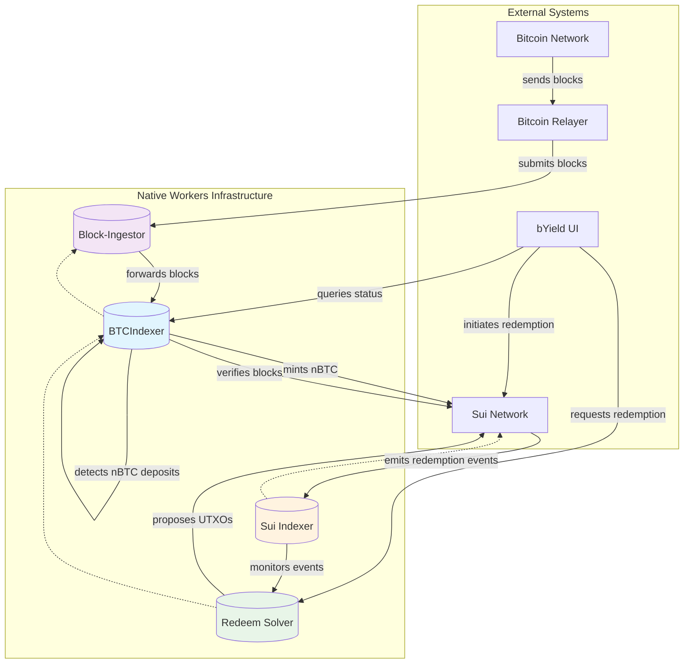

<!-- markdownlint-disable MD013 -->

# Workers

The Native Workers are services for a distributed system for cross-chain Bitcoin-to-Sui interoperability and BYield. The architecture consists of several specialized workers that communicate via service bindings to enable seamless nBTC operations.

Workers are based on the Cloudflare Workers framework.

## High-Level Architecture

### Functional Interactions

#### [Block Ingestor](./packages/block-ingestor/)

- Receives Bitcoin blocks from an external relayer via REST API
- Forwards blocks to BTCIndexer for processing
- Enables decoupled block processing through queue mechanism

#### [BTC Indexer](./packages/btcindexer/)

- Main component for Bitcoin-to-Sui bridging
- Processes Bitcoin blocks to detect nBTC deposits
- Handles cross-chain minting of nBTC tokens on Sui
- Provides status tracking for nBTC transactions
- Runs scheduled cron jobs for continuous processing

#### 3. [Redeem Solver](./packages/redeem_solver/)

- Handles nBTC redemption requests from users
- Tracks available UTXOs for redemptions
- Proposes appropriate UTXO sets for withdrawal transactions
- Coordinates with BTCIndexer for consistent state

#### 4. [Sui Indexer](./packages/sui-indexer/)

- Monitors Sui blockchain for nBTC-related events
- Polls active packages for nBTC operations
- Provides indexing capabilities for cross-chain activities

#### 5. [Shared Library](./packages/lib/) (`lib`)

- Provides common utilities, types, and configurations
- Offers logging infrastructure used across packages
- Ensures consistent implementation across all workers

### Functional Flows

1. **nBTC Minting Flow**: Bitcoin deposits → Block-Ingestor → BTC-Indexer → Sui minting
2. **Redemption Flow**: nBTC burn on Sui → Sui-Indexer → Redeem-Solver → UTXO proposal
3. **Status Tracking Flow**: UI requests → BTC-Indexer → Status updates

### Architecture Diagram



## Setup

### Dependencies

- bun >= 1.20.0
- proper editorconfig mode setup in your editor!
- Go (for Go API Client for the workers)

### Bun workspace

This is a monorepo: workspace with several sub packages.
Check [linking dependencies](https://bun.sh/docs/install/workspaces) to learn how to manage dependencies between sub-packages.

### Quick setup - dev

Firstly install the latest dependencies and link hooks

```sh
make setup-hooks
bun install
```

Navigate to a package that you want to build or run in the `/packages` directory.
To overwrite env vars used in your wrangler setup, copy: `cp .dev.vars.example .dev.vars` and update the values.

You will also need to setup a secrets store. For each secret defined in the `wrangler.json`:

- check the `store_id` and `secret_name`.
- create a secret with scope `workers`. Example: `bun wrangler secrets-store secret create 75adbc6657de4f4cb739f63eb4d0cd7a --name NBTC_MINTING_SIGNER_MNEMONIC --scopes workers`

Finally, you will need to set up databases used in local wrangler:

```sh
bun run db:migrate:local
```

### Populate nBTC Deposit Addresses

The nBTC deposit addresses are stored in the `nbtc_addresses` table in the D1 database. You need to populate this table with the deposit addresses for the networks you want to support.

You can insert address directly to the DB:

```sh
bun wrangler d1 execute btcindexer-db --local --command=\"INSERT INTO nbtc_addresses (btc_network, sui_network, nbtc_pkg, btc_address) VALUES ('regtest', 'devnet', '0x...', 'bcrt1q90xm34jqm0kcpfclkdmn868rw6vcv9fzvfg6p6')\"
```

Or (**Recommended**) refer to this [document](/packages/btcindexer/README.md#populating-the-nbtc_addresses-db) on how to run the scirpt.

### Run and test

Run the wrangler dev server of all workers (with auto reload):

```sh
bun run dev
```

Watch for changes and automatically test:

```sh
bun run test
# To test only some packages
bun run --filter package_pattern test
```

To enable logs during testing, use the `ENABLE_LOGS` environment variable:

```sh
ENABLE_LOGS=1 bun run test
```

### Typegen

Whenever you make changes to `wrangler.jsonc` or update `wrangler`, generate types for your Cloudflare bindings:

```sh
bun run cf-typegen
```

## Cloudflare RPC

Workers expose Cloudflare RPC. It is designed and limited to communicate directly between Cloudflare Workers, without going through HTTP endpoints. This enables efficient inter-worker communication using [Service Bindings](https://developers.cloudflare.com/workers/runtime-apis/bindings/service-bindings/rpc/).

The RPC interface is provided through an RPC class that extends Cloudflare `WorkerEntrypoint` type.

**RPC Interface** is the preferred way for inter-worker communication within Cloudflare Workers for better performance and type safety.

### Calling RPC Methods

Example usage in your client worker:

```typescript
export default {
  async fetch(request: Request, env: Env): Promise<Response> {
    // Access the RPC stub using the binding name:
    const btcIndexer = env.BTCINDEXER;

    // Call RPC methods directly
    const latestHeight = await btcIndexer.getLatestHeight();
    console.log(`Latest block height: ${latestHeight.height}`);

    return new Response("OK");
  },
};
```

### Benefits of RPC

1. **Type Safety**: Direct method calls with TypeScript types
2. **Performance**: No HTTP overhead
3. **Simplicity**: No need to serialize/deserialize HTTP requests
4. **Direct Object Passing**: Can pass complex objects directly between workers

## Contributing

Participating in open source is often a highly collaborative experience. We're encouraged to create in public view, and we're incentivized to welcome contributions of all kinds from people around the world.

Check out [contributing repo](https://github.com/gonative-cc/contributig) for our guidelines & policies for how to contribute. Note: we require DCO! Thank you to all those who have contributed!

After cloning the repository, **make sure to run `make setup-hooks`**.
