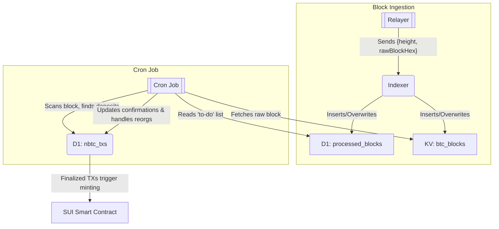

# Native Bitcoin Indexer

Objectives:

- Proving and tracking nBTC deposits.

## Components

- Relayer: An external service that acts as source of truth for Bitcoin blocks.
- Indexer (Cloudflare Worker): The service that listens for new blocks and runs periodic processing jobs.
- KV Store: Simple key-value store for raw Bitcoin block data.
- D1 Database: SQL database that stores structured data about blocks and nBTC deposit transactions.
  - `processed_blocks`: A queue of new blocks that need to be scanned.
  - `nbtc_txs`: The main ledger tracking the status of every nBTC deposit.

## Indexer Workflow

### 1. Block Ingestion Flow (push)

This is triggered every time the Relayer sends new block data to the indexer

1.  Block Submission: The Relayer sends a batch of new blocks (`height` and `rawBlockHex`).
2.  Reorg Handling: If the Relayer sends a block for a `height` that already exists in the `processed_blocks` table, the indexer overwrites it with the new one. This means a reorg happened on Bitcoin.
3.  Storage: The indexer saves the full raw block data to the KV store and adds (or updates) the light block info (`height`, `hash`) in the `processed_blocks` table in D1. This table acts as a "to-do" for the cron job.

### 2. Processing Flow (Cron Job)

A cron job runs on a fixed schedule (e.g., every 1 minute)

1.  Deposit Discovery: The cron job reads a batch of unprocessed blocks from the `processed_blocks` queue. It fetches the full block data from KV and scans every transaction. If it finds a valid nBTC deposit, it saves the details to the `nbtc_txs` table with a status of `'confirming'`.
2.  Confirmation & Reorg Processing: The cron job then queries for all transactions in the `confirming` state.
    - Confirmation Update: It calculates the number of confirmations for each transaction based on the latest known block height. If a transaction has enough confirmations its status is updated to `finalized`.
    - Reorg Detection: It checks if the `block_hash` for a transaction's block height still exists in the `processed_blocks` table. If it doesn't (because it was overwritten during ingestion), the transaction has been reorged. Its status is changed to `reorg`. This transaction is now considered invalid, but we keep the record for indexing purposes.

### 3. nBTC Tx (Push)

To quickly handle UI nBTC transaction observability, BYield UI will push nBTC transaction, in order to let the indexer start monitoring it. This way UI will have the quick status about the TX, before the tx is added to the blockchain.
