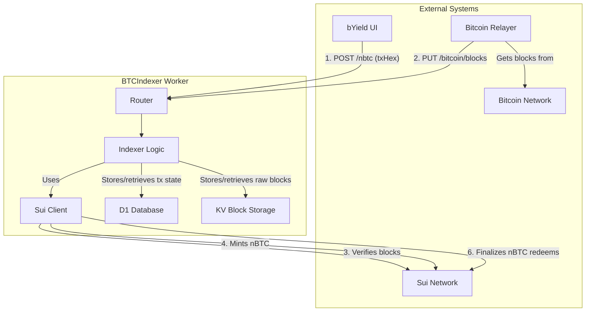
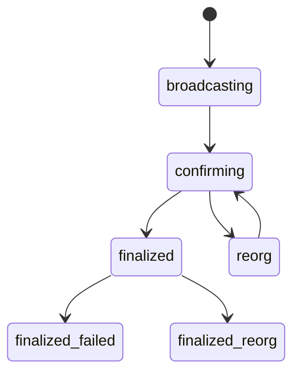

# Native Bitcoin Indexer

## Objectives

- Tracking nBTC transactions
- Creating Merkle Proofs and submitting to related Sui objects to handle the Bitcoin transaction effects.

## Architecture Overview



## API

See [API.md](./API.md)

**Note:** A mock implementation (`BtcIndexerRpcMock`) is available for local development and testing. See [API.md](./API.md#mock-local-developmenttesting) for details.

## Populating the nbtc_addresses DB

To populate the `nbtc_addresses` you can use the `seed:addresses` script. This script reads addresses from the `scripts/nbtc_addresses.json` file and inserts them into the database.

- For local development:

  ```sh
  bun run seed:config --local
  ```

- For the remote (production/backstage):

  ```sh
  bun run seed:config
  ```

  You can add or modify the addresses in the `scripts/config.ts` file to manage the list of deposit addresses.

## Components

The `btcindexer` worker is a Cloudflare Worker responsible for monitoring the Bitcoin blockchain for nBTC deposits, processing them, and coordinating the minting of nBTC tokens on the Sui blockchain.

## 2. Components

- **Main Worker (`src/index.ts`):** The entry point for all incoming requests. It handles HTTP requests, and scheduled cron jobs, and delegates tasks to the appropriate modules.
- **Indexer (`src/btcindexer.ts`):** The core logic for processing Bitcoin blocks and transactions. It identifies nBTC deposits, tracks their confirmation status, and manages the minting process.
- **Router (`src/router.ts`):** Defines the REST API endpoints and routes incoming requests to the correct handlers.
- **Sui Client (`src/sui_client.ts`):** Interacts with the Sui blockchain to mint nBTC tokens.
- **Storage (`src/storage.ts`, `src/cf-storage.ts`):** Manages data persistence using Cloudflare D1 and KV stores.

## 3. Tracking Bitcoin transactions

The `btcindexer` tracks the state of nBTC related transactions as they progress through the system.

The state is stored in the `nbtc_minting` and `nbtc_withdrawal` tables in the SQL (D1) database.

Bitcoin transaction can have one of the following status:

- `broadcasting`: The deposit transaction has been broadcast to the Bitcoin network, but has not yet been included in a block.
- `confirming`: The deposit tx has been found in a Bitcoin block but does not yet have enough confirmations.
- `finalized`: The tx has reached the required confirmation depth and is ready to be minted.
- `reorg`: A blockchain reorg was detected while the tx was in the 'confirming' state. The tx block is no longer part of the canonical chain.
- `finalized-reorg`: An edge-case status indicating that a tx was marked 'finalized', but was later discovered to be on an orphaned (re-org deeper than the confirmation depth).

State machine:



Moreover, the minting transaction can have one of the following extra status:

- `minting`: The minting process on the Sui blockchain has been initiated.
- `minted`: The nBTC has been successfully minted on the SUI network.
- `finalized-failed`: An attempt to mint a finalized tx failed, but it may be retried.

## 4. Cron Handler

The worker is triggered by a Cloudflare cron every minute (`* * * * *`) to perform the following tasks:

- Scan for new blocks that have been added via the `PUT /bitcoin/blocks` endpoint.
- Process new blocks to find nBTC deposits.
- Update the confirmation count for existing deposits.
- Finalize transactions that have reached the required confirmation depth.
- Initiate the minting process for finalized transactions.
- Retry failed minting attempts.

## 5. Reorg Handling

The `btcindexer` worker handles Bitcoin reorgs to ensure that only transactions on the canonical chain are processed. The worker relies on a combination of an external relayer and a Sui light client for verification.

1.  Relayer: Its the source for the full blocks, its the same service responsible for keeping the on-chain light client up to date, The data it sends to the worker is the same.

2.  Sui Light Client: The source of truth for the canonical chain. The worker communicates with this light client to verify the validity of block headers before finalizing any transactions. This has been introduced as a safety measure in case the relayer is compromised, or there is a `better` relayer running, updating only the light client.

### Detection

The worker employs two primary mechanisms to detect reorgs:

1.  SPV Light Client. Before attempting to finalize any transactions, the worker performs an SPV check by calling the `verify_blocks` endpoint on the Sui light client. It sends the block hashes of all transactions currently in the `confirming` state. If the light client reports that any of these block hashes are not part of the canonical chain, the worker updates the status of all transactions within those blocks to `reorg`.

2.  Internal Consistency Check. The worker continuously checks for internal consistency. When processing pending transactions, it compares the block hash stored with the transaction against the block hash stored for that same block height in its own database. If the hashes do not match, it indicates that the relayer has provided a new block for that height, and a reorg has occurred. The affected transaction is then marked with the `reorg` status.

## 6. Workflow

### 1. Block Ingestion Flow (push)

This is triggered every time the Relayer sends new block data to the indexer

1.  **Block Submission:** The Relayer sends a batch of new blocks (`height` and `rawBlockHex`).
2.  **Reorg Handling:** If the Relayer sends a block for a `height` that already exists in the `processed_blocks` table, the indexer overwrites it with the new one. This means a reorg happened on Bitcoin.
3.  **Storage:** The indexer saves the full raw block data to the KV store and adds (or updates) the light block info (`height`, `hash`) in the `processed_blocks` table in D1. This table acts as a "to-do" for the cron job.

### 2. Processing Flow (Cron Job)

A cron job runs on a fixed schedule (e.g., every 1 minute)

1.  **Deposit Discovery:** The cron job reads a batch of unprocessed blocks from the `processed_blocks` queue. It fetches the full block data from KV and scans every transaction. If it finds a valid nBTC deposit, it saves the details to the `nbtc_txs` table with a status of `'confirming'`.
2.  **Confirmation & Reorg Processing:** The cron job then queries for all transactions in the `confirming` state.
    - **Confirmation Update:** It calculates the number of confirmations for each transaction based on the latest known block height. If a transaction has enough confirmations its status is updated to `finalized`.
    - **Reorg Detection:** It checks if the `block_hash` for a transaction's block height still exists in the `processed_blocks` table. If it doesn't (because it was overwritten during ingestion), the transaction has been reorged. Its status is changed to `reorg`. This transaction is now considered invalid, but we keep the record for indexing purposes.

### 3. nBTC Tx (Push)

To quickly handle UI nBTC transaction observability, BYield UI will push nBTC transaction, in order to let the indexer start monitoring it. This way UI will have the quick status about the TX, before the tx is added to the blockchain.

### 4. nBTC minting mapping

We index nBTC minting transactions by the Sui recipient and the BTC deposit sender.
While technically possible its very unlikely the bitcion mint transaction will have more than one bitcion sender, thats why we are simplyfying it here and we just assume the first input utxo is the sender of the whole transaction.
This might lead to a problem where user logged with one of their wallet will see the entire transaction on the minting page, and when swtiching to another wallet the user will not see it.
