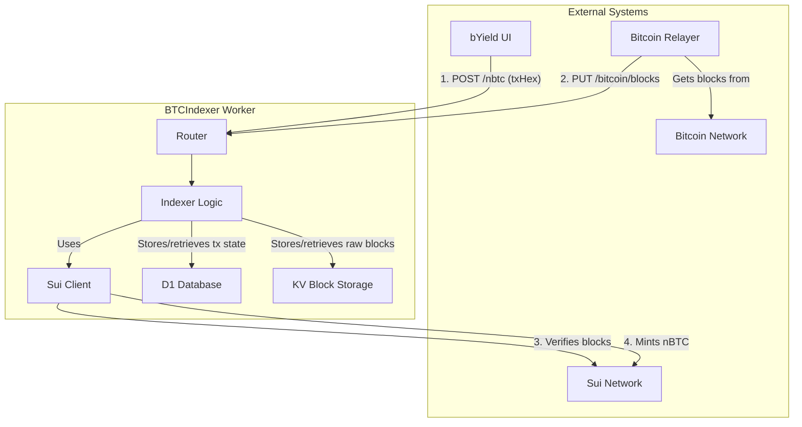

# Native Bitcoin Indexer

**Note:** For a more detailed and up-to-date explanation of the btcindexer's architecture, state machine, and API, please see the [DOCUMENTATION.md](./DOCUMENTATION.md) file.

## Objectives

- Proving and tracking nBTC deposits.

## Architecture Overview

