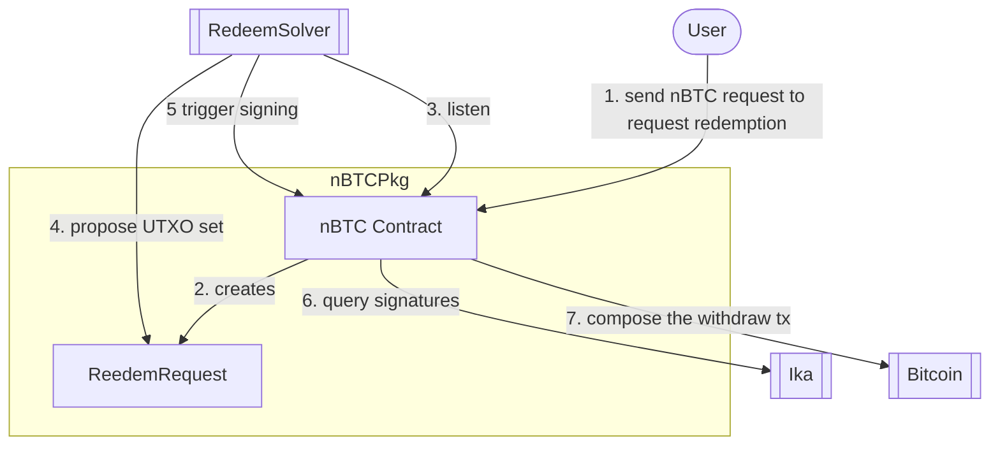

# Redeem Solver

## Objectives

- Observing nBTC Redeem transactions.
- Tracking nBTC UTXOs (NOTE: we can use electrs for that).
- Propose spend UTXOs for redeem transactions.

## Flow

## API

- [API Reference](./API.md)

## UTXO management

In Bitcoin all BTC is stored and modelled as UTXO.
Whenever a user makes a deposit to mint nBTC, we receive UTXO that we need to manage.
Whenever a user wants to redeem nBTC for BTC - we need to find best matching UTXO set to satisfy the redeem request. This is a complex problem because:

- @e need to optimize for on chain computation (transactions are composed and signed on chain, hence they can't be too big).
- Protocol has to be stable to avoid future updates (if possible).
- Protocol must not have a single point of failure: multiple parties should be able to trigger every step and propose a solution. The best solution should be trustlessly selected and executed.

### Redeem Request UTXO Selection Algorithm

### v0.1 (current strategy)

We are using a simple strategy: first valid proposal will be served. The smart contracts validates the proposal (check the UTXO limit, amount and validity of the UTXOs).

### v1.0 (testnet-v3)

Scoring Logic. Let:

- inputs = number of UTXOs in the proposal
- sum = total satoshis of inputs
- change = sum - (withdraw + fee)
- inactive_bonus = bonus per input whose spend_key is in inactive_spend_keys
- exact_spend_bonus = we add a bonus for exact pay and penalties for dust or regular change.

We optimise for: minimizing the change and add bonuses.

### UTXO Lifecycle

The lifecycle of a UTXO flows through the following states, tracked in the `nbtc_utxos` database table.

#### A. Ingestion (Created)

UTXOs are NOT inserted directly by the Bitcoin Indexer. Instead, they are ingested **after** the nBTC minting is confirmed on Sui.

1.  **User Deposit:** User deposits BTC. `BTCIndexer` detects it and calls the Sui nBTC contract to mint.
2.  **Mint Event:** The `NBTC` contract emits a `MintEvent`.
3.  **Indexing:** The `SuiIndexer` picks up this event.
4.  **Storage:** The `SuiIndexer` extracts the Bitcoin `txid`, `vout`, `amount`, and `script_pubkey` from the event and inserts a new record into `nbtc_utxos` with status `AVAILABLE`.

#### B. Availability

Once inserted, the UTXO is in the `AVAILABLE` state.

- It belongs to a specific `dwallet_id`
- It is eligible for selection by the `RedeemSolver` to fulfill redemption requests.

#### C. Locking (Proposed)

When a user requests to redeem nBTC for BTC:

1.  **Selection:** The `RedeemSolver` selects `AVAILABLE` UTXOs to cover the requested amount.
2.  **Locking:** The solver updates the UTXO status to `LOCKED` and sets a `locked_until` timestamp.
3.  **On-Chain Proposal:** The solver submits a `ProposeUtxo` transaction to Sui.
4.  **Confirmation:** The `SuiIndexer` listens for the `ProposeUtxoEvent` and confirms the lock in the database (ensuring consistency if multiple workers are running).
    NOTE: if there is another `ProposeUtxoEvent` for the same redeem request (redeem_id), it means our previous proposal has been bested and overwritten, so we can `UNLOCK` those UTXOs.

#### D. Spending (Redemption)

1.  **Signing:** Ika network signs the Bitcoin transaction spending these UTXOs.
2.  **Broadcast:** The `RedeemSolver` broadcasts the transaction to the Bitcoin network.
3.  **Completion:** Once broadcast/confirmed, the UTXOs are `SPENT`.

#### E. Unlocking (Expiry)

If a redemption proposal fails, or times out:

- The `locked_until` timestamp allows the system to treat these UTXOs as `AVAILABLE` again after the lock duration expires.

### Storage & Ownership

UTXOs are stored in the `nbtc_utxos` table in the D1 database.

| Column          | Description                                                                  |
| :-------------- | :--------------------------------------------------------------------------- |
| `nbtc_utxo_id`  | Unique ID assigned by the Sui contract (u64).                                |
| `dwallet_id`    | The Sui object ID of the DWallet that "owns" this UTXO on Bitcoin.           |
| `txid` / `vout` | The Bitcoin outpoint identifiers.                                            |
| `amount`        | Value in satoshis.                                                           |
| `status`        | State: `'available'`, `'locked'`, `'spent'`.                                 |
| `locked_until`  | Epoch timestamp (ms). If `current_time > locked_until`, the lock is expired. |

**Key Concept:** The database acts as a cache of the on-chain state. The `SuiIndexer` ensures this cache stays synchronized with the canonical state on the Sui blockchain.
