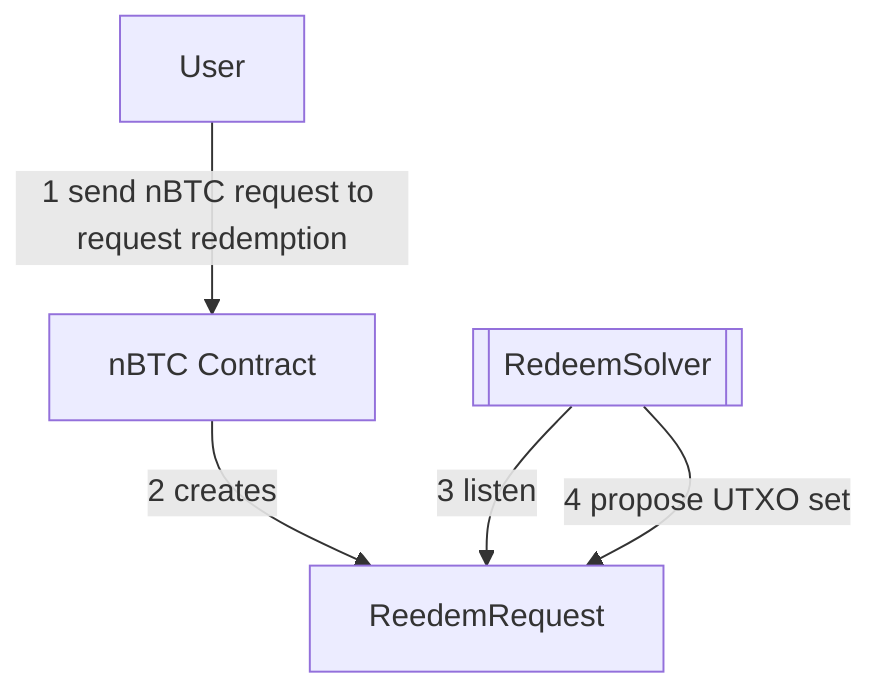

# Redeem Solver

## Objectives

- Observing nBTC Redeem transactions.
- Tracking nBTC UTXOs (NOTE: we can use electrs for that).
- Propose spend UTXOs for redeem transactions.

## Architecture Overview

TODO: link full redeem documentation.

## API

See [API.md](./API.md)
